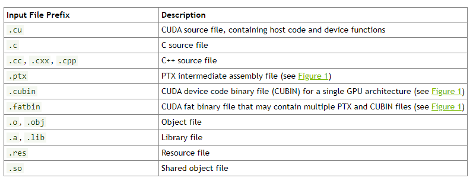

# 基于 CUDA 的异构并行计算

## 一些指标

- 延迟

从开始到完成所需要的的时间。

- 带宽

单位时间内可以处理的数据量。单位：MB/s 或 GB/s。

- 吞吐量

单位时间内成功处理的运算数量。单位：gflops (每秒十亿次的浮点运算数量)

- **峰值计算性能**

每秒能处理的单精度或双精度浮点运算的数量。单位：GFlops  或 TFlops。计算方式：
$$
理论峰值 ＝ GPU芯片数量＊GPU Boost主频＊核心数量＊单个时钟周期内能处理的浮点计算次数
$$
如对 Tesla P100，其理论峰值性能：
$$
双精度理论峰值 ＝ FP64 Cores ＊ GPU Boost Clock ＊ 2 ＝ 1792 ＊1.48GHz＊2 = 5.3 TFlops
$$

$$
单精度理论峰值 ＝ FP32 cores ＊ GPU Boost Clock ＊ 2 ＝ 3584 ＊ 1.58GHz ＊ 2 ＝  10.6 TFlops
$$

因为 P100 还支持在一个 FP32 里同时进行 2 次 FP16 的半精度浮点计算，所以对于半精度的理论峰值更是单精度浮点数计算能力的两倍也就是达到 21.2TFlops 。可参考[nvidia-tesla-p100-datasheet](assets/nvidia-tesla-p100-datasheet.pdf)。

- **内存带宽**

芯片从内存中读取或写入数据的比率。单位：GB/s。计算方式：
$$
显存带宽(GB/s)=显存实际频率 (MHz)*显存数据倍率*显存等效位宽(bit)/8
$$

$$
等效显存频率 = 显存实际频率(MHz)*显存数据倍率
$$

但是，现在各家厂商越来越流行用显存速率来标注显存，公式可简化为：

$$
显存带宽(GB/s)=显存数据频率(Gbps)* 显存等效位宽(bit)/8
$$

举例来说，新版GTX 1080上使用的GDDR5的显存带宽就为11*256/8=352GB/s。

直观的例子：我们假设往瓶子里灌水，GPU就好比是水龙头，而显存就是盛水的瓶子，想要快速把瓶子装满有两种方法，一是加快水龙头的流速，二是增大水龙头的直径，而流速就是指显存速率，直径指的就是显存位宽。当然，最理想的情况是两种方式同时进行，而同时进行指的就是增大显存带宽，这也正是HBM高带宽显存肩负的使命——让显存不拖累GPU性能。

## 代码

[chapter01](../../sources/chapter01)

## 习题

4. 核函数中`printf`只在计算能力2以上有效。

```cuda
__global__ void test()
{
#if __CUDA_ARCH__ >= 200
    printf("Hi Cuda World");
#endif
}
```

5. nvcc 对以下后缀的文件支持编译



## 参考

[显存带宽该怎么算](http://vga.zol.com.cn/644/6446935.html)

[NVIDIA GPU的浮点计算能力](https://blog.csdn.net/zong596568821xp/article/details/103957058)